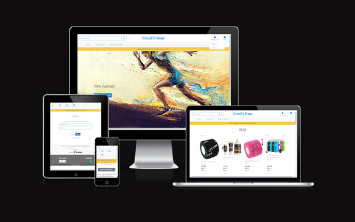

Simple and practical website for CrossFit fanatics!

CrossFit Gear is a full stack e-commerce web application with a small, unique selections of products and gifts that someone interested in the world of CrossFit will enjoy. Or a friend who wants to surprise a love one with a funky gift.

This website is for educational purposes only. So on this website please use only the details below in the card sections 
Card number: 4242 4242 4242 4242
Use any expiration date (month/year) in the future, any 3 digit CVC code and 5 digit post code.

This website is my five and final ‘Milestone Project’ as part of the Full Stack Development journey of Code Institute. The focus is on using the Django framework,  an authorisation and authentication system and using, learning about  Stripe for payments and AWS cloud base storage services. 

A live website can be view on https://crossfit-gear.herokuapp.com/

# Feedback from last submission:

1.2	No	Confirmation e-mails are not sent on successful purchases.
this has been rectifiedm there was an issue with the webhook, see confirmation email example

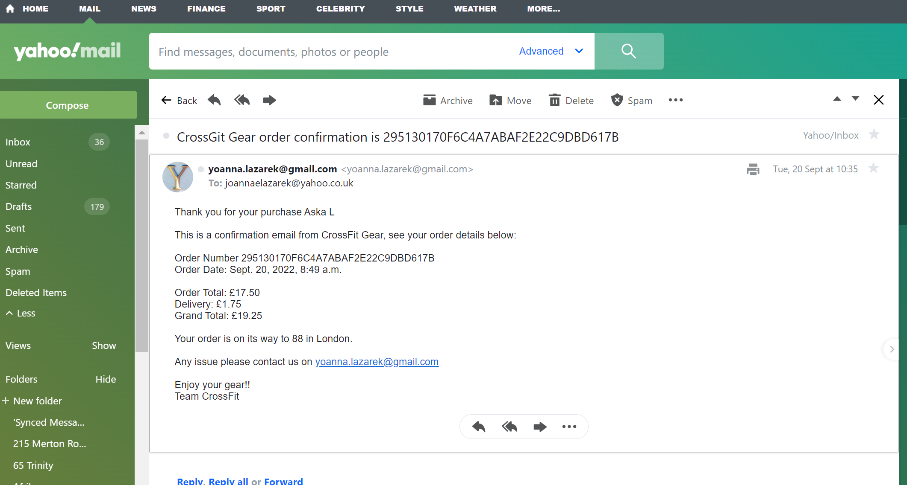

1.6	No	Code does not pass validation tools
Please find attached README Testing.md I have tested all the files as requested

1.9	No	Python logic is limited to code displayed in course walkthrough projects and is not indicative of abilities with the Python language
I have created 3 new models
Contact US
Review product
Wishlist 

1.12	No	There is scope for further customization on the existing custom Django models
I have made changes to my website, created a new footer with social links and Contact Us forms. I have added Wishlist function to my "My account" and few other layout changes 

2.5	No	Wireframes, mockups, and diagrams created as part of the design process are missing from the README.
Please see mobile and tablet size wireframes attached in User story section 

3.4	No	rel attributes, as defined by this criteria, are not present
I have 2 external links on this site, I've added rel attibutes to both of them and student care confirm that this is acceptable
<a class="btn btn-link btn-floating-central  m-1 text-white hvr-buzz" style="background-color: #3b9851;" href="https://www.crossfit.com/" target="_blank" rel="noopener"

# Business Model
I’ve created this website, as my self I’m a keen crossifiter and noticed there are not a lot of website dedicated to this discipline. Also few of my friends wanted to get my some CrossFit related gifts for my bday or xmas but,  didn’t know where to go, where to start
The website has a simple laylout and only few products as this is quite a niche sport and want to test the waters on what products are popular before I change my stock. 

This is a Business to Customer (B2C) application, selling CrossFit products/accessories with a single payment model using stripe 

Marketing tools: To attract more traffic to my website I’ve used few marketing tools.  SEO have been used by adding keywords to the code so and organic Social media, which for a small website like this works great, as I’m starting to build my brand identity and connect and interact with potential customers directly. The CrossFit world already using social media and share it content so my audience would be easy to reach. My Business Facebook has few links to my CrossFit gyms in London and few posts regarding some of the products, I can receiving feedback on the products, also it can be easily share with other within social platforms.
I have also created a subscribe function so the costumers can opt in to receive an email information from me, regarding new products and any sales. So I can keep promoting my little business. 

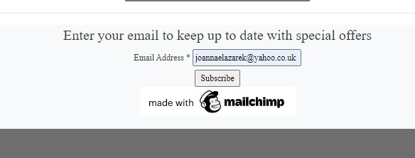

Features: The website is a to provide a product to my customers so I follow the course example and created a simple payment method and adding an authentication system for extra security. The customer can search and filter products, which have images and short description and the product also have rating system.  The shopping basket is provides overview of the order and allows the customer to add, delete and update the content. 

Database: The purpose of this website is to provide a product to my customer and deliver it to them, so the data I need to store is:
•	Customer – name, username, first name, and password 
•	Products – image, name, price, etc.
•	Order – what products and the quantity, the user details (name, address, etc), total amount and delivery address 

## See user stories 

I have plan this project which I've based on the course material as a ecommerce website and I've used agile aproched as it is felxible and easier to make changes.
I've created the following wireframe, for this project, howerver the final project looks bit different. 

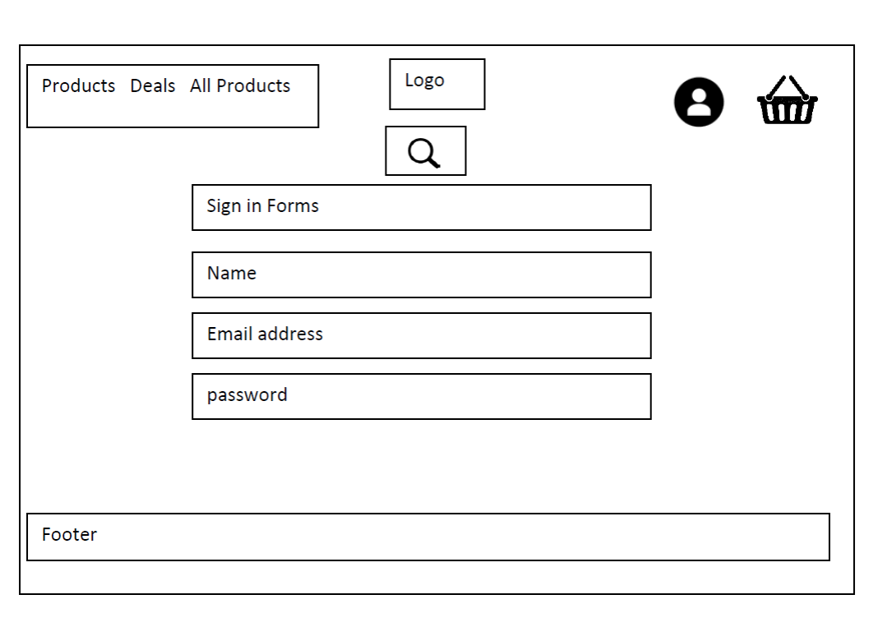

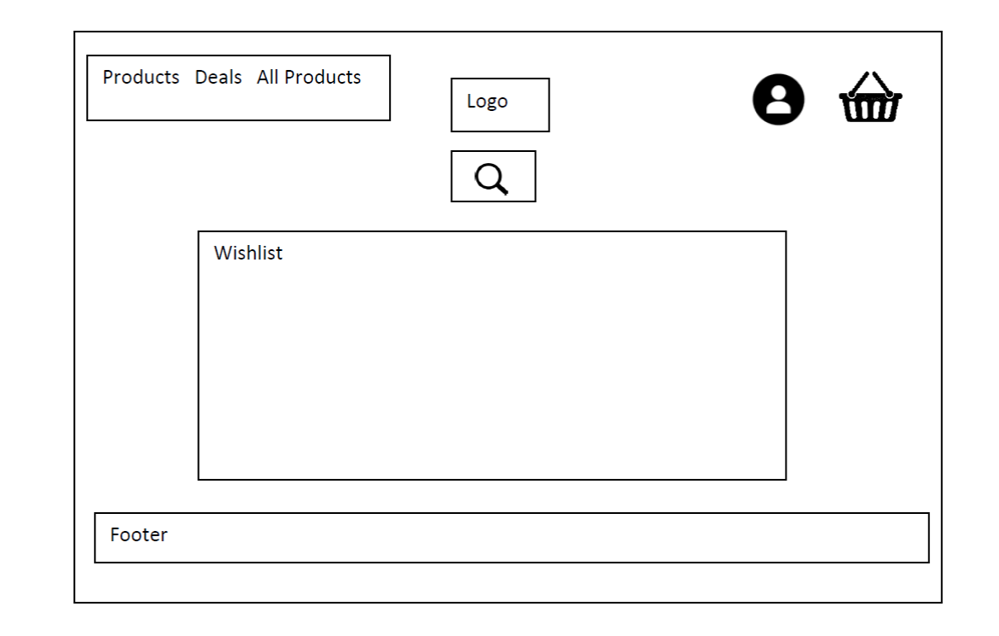

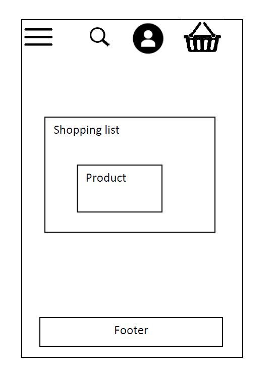

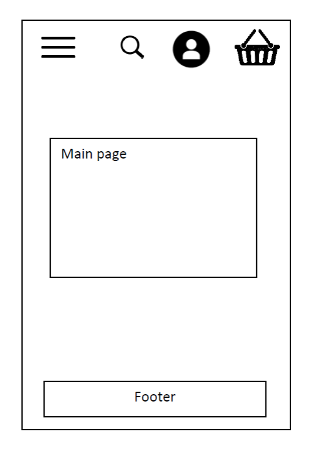

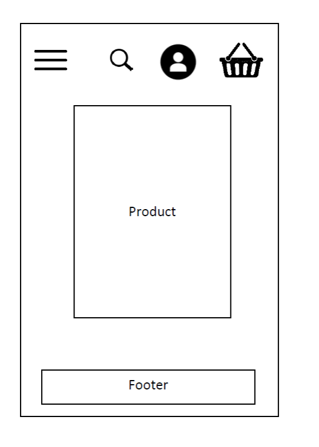

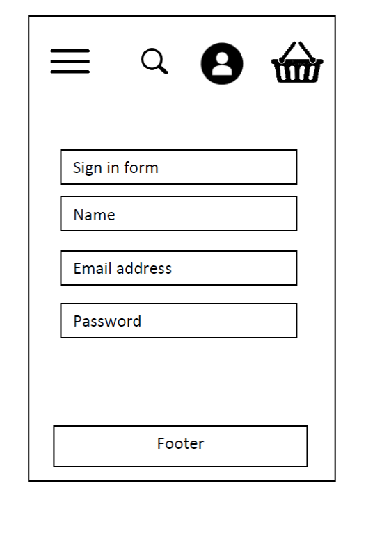

I've created user stories and input them as issue to Github and personalise lables with MoSCoW prioritization technique. I added few milestone of the project so I could reach the dealine without missing on any user stories.  With my still limited experience in codding, I've used storie points to estimate how long will it takes to complete them. Story point with 2 next to it will take twice as long as a story with only 1 point next to it and I've made lables for them too. Since I was the only one working on this project I've only used the tools that I need it.

I've used Board Boards as information radiator with 3 columns, TO DO, IN PROGRESS and DONE and moved the stories accordingly. 

Please see screenshots: 

### Requirements
1. A home page with nav bar
2. A design which is responsive on different screen sizes
3. A product page
4. A option to register and login to a personal account
5. A page with all the products
6. A all products page
7. Banner reading new deals
8. Adding products to a shopping baskets, choosing size and units
9. An option to search
10. An option to filter products
11. An indication of search and numbers of results
12. A page to checkout with the products and costs
13. Possibility to adjust the shopping basket
14. Secure checkout with the payment details using Stripe
15. Email confirming the purchase details
16. Secure admin site for the website owner to Add, Edit, Delete a product

### Additional requirements 
1. Recover your password

# Structure of the website
The overall look is kept the same on each page as much as possible, to enhance single-use-learning:
* The header and footer are the same on each page.
* Buttons are styled in the same way.
* The layout is consistent

The navigation is simple and consistent:
* home page show nav bar
* The logo at the top of the page is also the link to the home page.
* Buttons can be used to navigate products sorting, products categories and special offers
* Search button, profile, and shopping basket buttons 
* "Have a look" button which takes user to all products page
* banner with a wrapping deal if the purchase spends more than £25

The information provided should be easily visible:
* The user see on which page they are, e.g. by using headers.
* The user gets a visual feedback during certain actions (e.g. focussing on, clicking on, hovering over buttons and links).
* Messages(toasts) are used to confirm or inform about current actions.

## Wireframes (home page, shop page, basket, login, signin profile, eamil confirmation after purchase, mobile and tablet)

## Colors and  font
 * Roboto for font
 * Color - #555 and  rgb(64, 121, 187)

# Features
## Features 
* Responsive on all devices
* A nav bar allows user to navigate the website easier, on small devices in collapse into hamburger menu to make it readable
* Function to register for an account, by filling a form
* Function to log in an log out of the account, by filling a form 
* A search bar, to easily find a product 
* A search button to search by price, rating, and category
* Categories under the gear tap, to make it quicker to find a product
* A Special offers button to see what deal the site can offer
* Payment function using Stripe
* Toast messages to inform user after completing a function 
* A confirmation modal after purchasing 

## Forms
* A resister form to sign up for a account
* A sign in form
* A checkout form for the purchasing, with the payment details
* A form that allows to add, review and delete products - admin access only

## CRUD (Create, Read, Update, Delete) function

* Create 
    1. Admin to create a new product 

* Read 
    1. Users can search and view products in detail

* Delete
    1. Admin can delete any products from the site

## Features still to be implement
1. Delete a user/profile by the user 

# Testing - maunal 
I have did few manual testing of my site, checked if all the buttons/funtion works.

loging in, loging out, register, checkout function, make a purchase, searching for products 

Register functionality
Expected:
A user can register to the website by filling in the sign up form correctly.
Testing:
1.	Go to the signup page by clicking 'my account' and then on 'signup' in the navbar.
2.	Don't fill in the signup form and click 'Sign up'.
3.	Confirm that a warning message appears.
4.	Only fill in an email address and click 'Sign up'.
5.	Confirm that a warning message appears.
6.	Repeat steps 4 and 5 for username and password.
7.	Fill in an email address, a unique username and a password.
8.	Confirm that the message 'Verify your e-mail address' appears.
9.	Confirm that a toast message appears with the text 'Confirmation e-mail sent to X.' (X = your email address).
10.	Go to your email inbox and confirm an email was sent to confirm your email address.
11.	Click the link in the email.
12.	Confirm that you're redirected to a page to confirm your email address.
13.	Click the 'Confirm' button.
14.	Confirm you are redirected to the signin page.
15.	Confirm a success toast message appears with the text 'You have confirmed X.'.
16.	Log out by clicking the logout button in the navbar.
17.	Repeat the sign up process with the same details you entered before.
18.	Confirm that the message 'A user is already registered with this e-mail address.' appears.
Result:
A user can register to the website by filling in the register form correctly.

Login functionality
Expected:
A user can log in to the website by filling in the login form correctly.
Testing:
1.	Go to the sign in page by clicking 'my account' and then on 'signin' in the navbar.
2.	Don't fill in the login form and click 'Sign in'.
3.	Confirm that a warning message appears.
4.	Only fill in the username and click 'Sign up'.
5.	Confirm that a warning message appears.
6.	Only fill in the password.
7.	Confirm that a warning message appears.
8.	Fill in a wrong username and password.
9.	Confirm that the message 'The username and/or password you specified are not correct.' appears.
10.	Fill in your username and password.
11.	Confirm you are redirected to your home page.
12.	Confirm a success toast appears with the text 'Successfully signed in as Y.' (Y is your username).
Result:
A user can log in to the website by filling in the login form correctly.

Contact us functionality
Expected:
A user can fill the form and contact the website
Testing:

Logout functionality
Expected:
A user is logged out when they click on the logout link in the navbar.
Testing:
1.	Click on Contact us button in the footer
2.  Fill in the Name, email address, subject and message
3.  Click send, and the user gets to "Thank you for contacting Us" screen
Result:
A user is receives an email confirmation that question has been received and admi received an eamil as well and the request is saved database

However, I've noticed that the eamil is not being sent, there was no error on the termial or code, I've run out of minutes for the tutor to help me and my mentor had a full day.
I've checked the code, reach out to the slack community but there was no one who could have put on the right track. The function did work, and been tested few weeks back. I'm not sure what happend that is not longer functional.

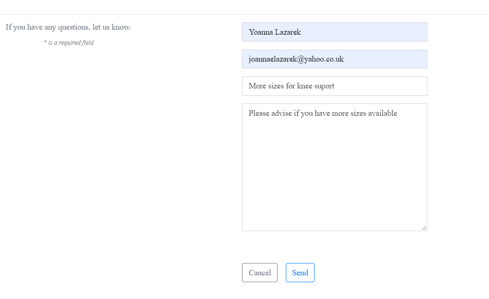

Search bar
Expected:
A user can go to the search bar and search products by keyword (name or description).
Testing:
1.	On any page, click the search icon at the top of the page.
2.	Confirm a search bar pops up.
3.	Fill in the keyword 'chalk' in the search bar.
4.	Confirm that you are redirected to the shop page and the product chalk category  is shown and number of results 
5.	Fill in the keyword ‘Peter”
6.	No results 
Result:
A user can go to the search bar and search products by keyword (name or description).

see the sort button on the products page sort products by price, rating, name or category, both ascending and descending.

Error handler pages 
Expected:
A user gets a error 404 page when a page can't be displayed and can get back by clicking a button.
Testing:
1.	Go to any page.
2.	In the browser's address bar, remove or add one or more characters at the end and press enter.
3.	Confirm a message '404 page not found' is shown.
4.	Confirm there is a button 'Go back home' at the bottom of the page.
5.	Click the button and confirm you are redirected to the home page of the website.
Result should be:
A user  gets a error 404 page when a page can't be displayed and can get back by clickin a button.

However, I'm not sure why this is not displaying in this way - and I've run out of the tutor minute so I had no help.

Stripe functionality
Expected:
When a user buys a product, the Stripe payment process is secure and working.
Testing:
1.	Go to the shop page and select a product and click 'add to bag'.
2.	Click the 'go to secure checkout' button and then the 'secure checkout' button.
3.	Fill in the delivery information form.
4.	For the credit card payment information use 4242 4242 4242 4242, any date in the future, any cvc number and any postcode and click 'complete order'.
5.	Confirm you are redirected to the checkout succes page with an overview of your order.
6.	Confirm a success toast message appears with the text 'Order successfully processed! Your order number is #. A confirmation email will be sent to X. Where # = the ordernumber and X your email address.
7.	Check your email inbox and confirm you have received an email confirmation.
8.	Log in to your stripe account, go to 'Payments' and confirm the payment was succesfull.
9.	Log in to the django admin of the site, go to Orders and confirm the order was created.
10.	Repeat steps 1 to 4 but use 4000 0000 0000 3220 for the credit card payment information.
11.	Confirm a 3D Secure 2 authentication message pops up.
12.	Click 'Fail' and confirm that you are redirected to the checkout page and a message appears with the text 'We cannot verify your payment method. Please select another payment method and try again.'.
confirm the payment has failed and a message appears stating that your card has insufficient funds.
Result:
When a user buys a product, the Stripe payment process is secure and working.
Note: for extensive testing of Stripe see their guide on testing

Confirmation email functionality
Expected:
When a user buys a product, an confirmation eamil is being sent
Testing:
1. make a puchase, as per steps in stripe function
2. purchase confimation toast message appears
3. Checking the teminal and I can see the eamil confirmation
4. Email confirmation sent to confirm the purchase

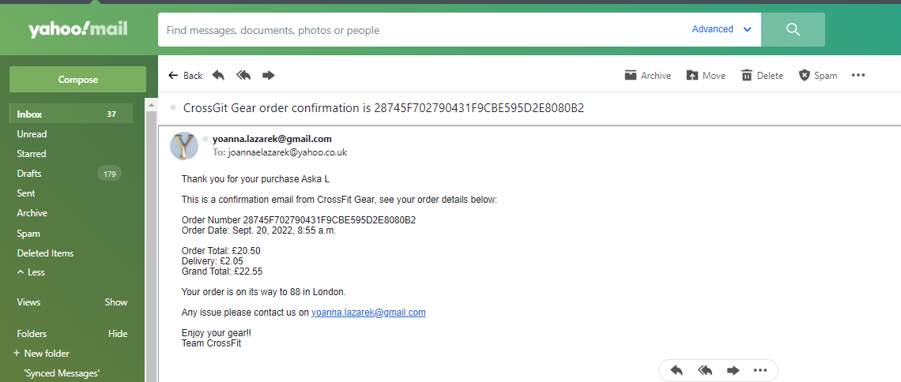

Social icons
Expected:
The user is redirected to the respective social media page, when they click on a social media icon.
Testing:
1.	Go to the nav bar.
2.	Click on a facebook icon .
3.	Confirm you are redirected to that social media page.
4.	Confirm that the page is opened in a new window.

Result:
The user is redirected to the respective social media page, when they click on a social media icon.
CRUD (Create, Read, Update, Delete) functionality.
User:

Add Review
Expected:
A new review is added when the user fills in the add review form.
Testing:
1.	Log in and go to the shop page.
2.	Select any product and scroll down to Reviews.
3.	Click on the 'Write a review' button.
4.	Confirm a add review form is shown.
5.	Don't fill out the review form and click the 'Submit' button.
6.	Confirm a warning message appears.
7.	Fill in the review form, except the review title.
8.	Confirm a warning message appears.
9.	Repeat steps 6 and 7 for comment and rating.
10.	Fill in the review form and the click the 'Submit' button.
11.	Confirm that a succes toast message appears with the text 'Review successfully added!'
12.	Confirm you stay at the product page.
13.	Scroll down and confirm that your review is added to the Reviews.
14. 
Result:
A new review added is added when the user fills in the add review form.

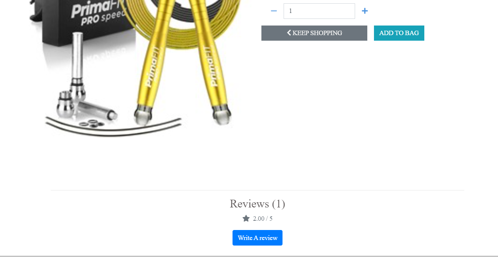

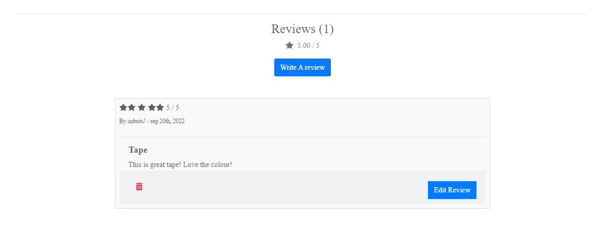

The reviews can be seen by the product details and in the profile page

Edit review
Expected:
An existing review is edited when the user fills in the edit review form.
Testing:
1.	Log in.
2.	Go to your profile page, go to 'My Reviews' and click the 'Go to Product' button.
3.	Confirm you are redirected to the product page and scroll down to Reviews.
4.	Confirm that your review has an 'Edit Review' button.
5.	Click the 'Edit Review' button and confirm you are redirected to the edit review page.
6.	Confirm the form is prefilled with the data of the existing review.
7.	Change any of the input fields.
8.	Click the 'Edit Review' button.
9.	Confirm that a succes toast message appears with the text 'Your review is edited successfully!'
10.	Confirm you are redirected to the product page.
11.	Scroll down to Reviews and confirm that your change is shown in the review.
Result:
An existing review is edited when the user fills in the edit review form.

Delete review
Expected:
A review is deleted when the user clicks on the 'DELETE' icon of a review.
Testing:
1.	Log in.
2.	Go to your profile page, go to 'My Reviews' and click the 'Go to Product' button.
3.	Confirm you are redirected to the product page and scroll down to Reviews.
4.	Confirm that your review has a 'Delete' icon.
5.	Click the 'delete' icon and confirm a modal pops up with the message 'Are you sure you want to delete this review?'
6.	Click 'Delete'.
7.	Confirm that a succes toast message appears with the text 'Your review has been deleted.'
8.	Confirm you stay at the product page.
9.	Scroll down to Reviews and confirm the review is deleted.
Result:
A review is deleted when the user clicks on the 'DELETE' icon of a review.

When log in as Admin 
Edit product 
Expected:
An existing product is edited when the admin fills in the edit product form.
Testing:
1.	Log in as admin.
2.	Go to your shop page and select any product.
3.	Confirm you are redirected to the product page.
4.	Confirm there is an 'Edit Product' button.
5.	Click the 'Edit Review' button and confirm you are redirected to the product management page.
6.	Confirm the form is prefilled with the data of the existing product.
7.	Change any of the input fields.
8.	Click the 'Edit Product' button.
9.	Confirm that a success toast message appears with the text 'Successfully updated product!'
10.	Confirm you are redirected to the product page.
11.	Confirm that your change is shown on the product page.
Result:
An existing product/trip is edited when the admin fills in the edit product form.

Delete product 
Expected:
A product/trip is deleted when the user clicks on the 'DELETE' button of a product
Testing:
1.	Log in as admin.
2.	Go to your shop page and select any product.
3.	Click the 'DELETE' button of one of your categories (tip: create a new test product first.).
4.	Confirm a modal pops up with the message 'Are you sure you want to delete this category?'
5.	Click 'YES'.
6.	Confirm that a success toast message appears with the text 'Product deleted!'
7.	Confirm you are redirected to the products page.
8.	Confirm the product is deleted.
Result:
A product is deleted when the user clicks on the 'DELETE' button of a product

Wishlist
Expected:
Product user likes in adding/removing from wishlist 
Testing:
1. Going to the product deatils and click "Add to wishlist"
2. the button changes to "Remove from wishlist"
3. got to the My wishlit in My account 
4. Go to "My Wishlist" and all products liked are there
5. The products can be removed from the wishlist
Result:
Adding product to my wishlist

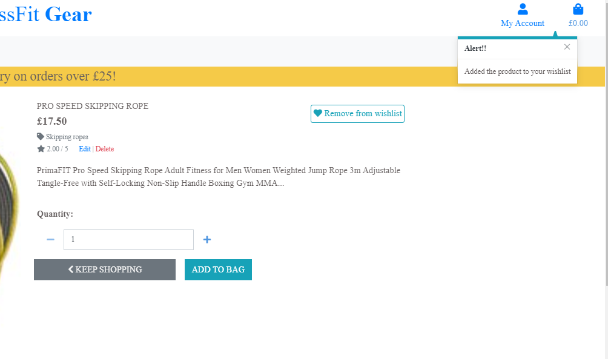

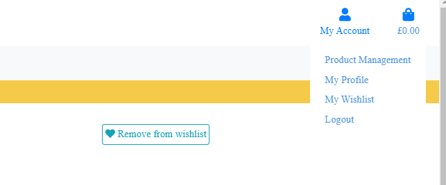

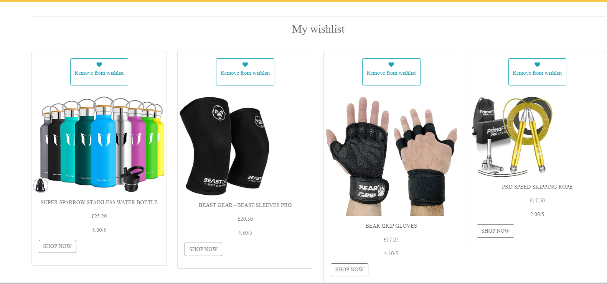

# Testing 

# Technologies used
## Languages
* HTML5 for markup.
* CSS for styling.
* Javascript for interactivity.
* Python3 for backend programming.

## Frameworks & libraries used
* Bootstrap - code snippets to assist with the responsiveness of the site
* jQuery, a javascript library 
* Google fonts 
* Font Awesome for the icons used
* Django is a high-level Python web framework for 

## Tools & Programmes used
* microsoft word to making the wireframes.
* Chrome Developer Tools to sort out any bugs, size issue
* GitHub for storing the files and version control of the website.
* PostgreSQL .
* Amazon AWS used to store static files after deployment.
* Heroku a cloud platform for deploying my site
* W3C Markup Validation
* W3C CSS Validation Service for CSS
* JSHint to check the Javascript code.
* PEP8 checker to clean up the code

# Deployment
The site was building using Git and pushed to GitHub:
    git add .
    git commit -m "commit message"
    git push

Heroku was used for deployment

## Heroku :

1. Create a heroku app
* Log in to my Heroku account
* Create a new app and follow instructions 

* Using "resource" tab and add a postgres to the app
* Submit the form

2. Postgress Database:
* Install dj_database and psycopg2.
    pip3 install dj_database_url
    pip3 install psycopg2-binary
* Create requirement.txt file and freeze and add the databases to the file 
* Add the databases in sittings files 
* Scroll down to DATABASES, comment out the default configuration and add the database url from Heroku
DATABASES = {
        'default': dj_database_url.parse('DATABASE_URL')
}
You can the database url from Heroku's Config Vars in the Settings tab.

* Run migration - python3 manage.py runmigrations
* Using local database loaddata db.json and import the categories 

3. Create a superuser form my admin panel
* Type: python3 manage.py createsuperuser
* Add a username and password

4. Local and remote database:
if 'DATABASE_URL' in os.environ:
    DATABASES = {
        'default': dj_database_url.parse(os.environ.get('DATABASE_URL'))
    }
else:
    DATABASES = {
        'default': {
            'ENGINE': 'django.db.backends.sqlite3',
            'NAME': BASE_DIR / 'db.sqlite3',
        }
    }

5. Installing gunicon - pip3 install gunicorn
6. Create Procfile and adding web: gunicorn appname.wsgi:application in the folder
7. Connect to heroku in the terminal - I had to use the Heroku login -i with my credetials 
    * Temporarily disable the collection of static files - heroku config:set DISABLE_COLLECTSTATIC=1 --app <Heroku appname>
    * add the host mame in settings.py - ALLOWED_HOSTS = ['<heroku appname>.herokuapp.com', 'localhost']
    * commit to GitHub
    * commit to Heroku - heroku git:remote -a <Heroku appname>
    * push to Heroku - git push heroku

8. Deploy from GitHub - after creating a new app - go to deploy page

* Automatic deploys - Enable Automatic Deploys

* I also manually deployed the app 

9. Set up Amazon AWS
    * Create a new account
    * Search for S3 in the search option 
    * Create a new bucket - crossfit-gear 

    * Select the right region
    * uncheck - block all public access
    * create bucket 
    * set basic settings - click on the backet name - properties - scroll down static website hosting and edit settings
        and enable static website hosting - type index.html index document  and error.html in Error document and save the changes
    * Find Permissions tab - edit function CORPS and past this configuration and save changes
{
	"Version": "2012-10-17",
	"Id": "Policy1655380121260",
	"Statement": [
		{
			"Sid": "Stmt1655380118565",
			"Effect": "Allow",
			"Principal": "*",
			"Action": "s3:GetObject",
			"Resource": "arn:aws:s3:::crossfit-gear/*"
		}
	]
}
    * Bucket policy - permission tab - scroll down to Bucket Policy and edit 

    * In the new window - select S3 Bucket policy in Step 1 - Select Policy Type
    *  Add Step 2 - Add Statements(s) as per image 
    * ARN is found on the policy generator as image

    * Click 'Generate policy'.
    * Copy the policy and paste it in the Bucket Policy of the first tab.
    * Add '/*' to the end of the resource key.
    * Click 'Save changes'.
    * Scroll down to Access control list (ACL) and click 'Edit'.
    * Select 'List' for Everyone (public access) and select 'I understand...' at the bottom. - save changes

    * Create AWS groups, policies and users
    * Click Iam (via search bar or Services).
    * Create a group
    * Click on 'Users groups' on the left.
    * Click 'Create group' and enter a group name.
    * Scroll down and click 'Create group'.
    * Create the policy used to access the bucket
    * Click on 'Policies' on the left.
    * Click 'Create policy'.
    * Click the JSON tab and then on 'Import managed policy'.
    * Search for 'S3' in the pop up window and select 'AmazonS3FullAccess' and click 'Import'.
    * Add media files to S3
        * Open the folder and click 'Upload'.
        * Click 'Add files' and select all your product images.
        * Under 'Permissions' select 'Grant public-read access'.
        * Select 'I understand...' and click 'Upload'.

10. Payment with stripe 

  * create an account with stripe - https://stripe.com/
  * Click developers and then API Keyy, use the public and secret key and add them to Config Vars in Heroku.
    * STRIPE_PUBLIC_KEY = <your Stripe public key>
    * STRIPE_SECRET_KEY = <your Stripe secret key>
    * Create a webhook endpoint
    * In Stripe - Developers click 'webhooks'.
    * Click 'Add endpoint'.
    * Enter your heroku url and add /checkout/wh/ to it.
    * https://<projectname>.herokuapp.com/checkout/wh/

    * Select 'receive all events' and click 'Add endpoint.
    * Scroll down to 'Signing secret' and click 'Reveal signing secret'.
    * Copy the signing secret and add to the Config Vars in Heroku.

11. Use s3 to store our static files.
    Add the ode to custom_storages.py
    from django.conf import settings
    from storages.backends.s3boto3 import S3Boto3Storage

# GitHub Repository
*   A fork is a copy of a repository. Forking a repository allows you to freely experiment with changes without affecting the original project. 

    * Login to GitHub and follow this link to the GitHub Repository.
    * At the top right of the page, click on the fork button.
    * You now have a copy of the repository in your GitHub account.
# Cloning the GitHub repository
    * Log in to GitHub find the repository 
    * Click on the ‘Code’ button

    * Click the button 'Clone Repository', add the url you copied above and hit enter.
    * A clone will be created locally.
   

# Credits

## Code
1. The project is heavily based on the Code Institute walkthrough project 5 - 'Boutique Ado". 
The Code has been copied and adopted form the videos provided

code for the footer was take and adjusted from 
https://www.w3schools.com/howto/howto_css_fixed_footer.asp

## Content
1. Product description have been taken from - https://www.amazon.co.uk/

## Media 
1. All the product images and descriptions - https://www.amazon.co.uk/
2. Main image - https://www.bing.com/images/

## Acknowledgements
* A big thank you to some of the very dedicated tutors who clearly love their job
* A thank you for all the advise I was able to search in Slack
